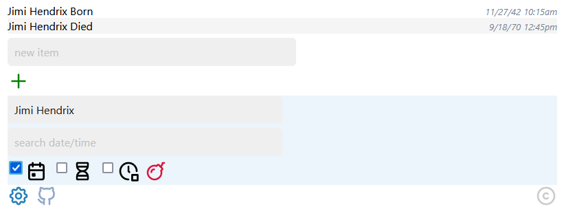
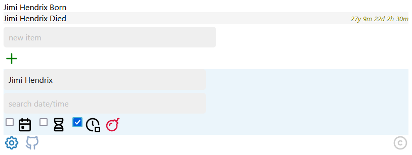

# othri
- othri is a simple list manager written in vanilla JavaScript as a single page app
- It runs strictly in the browser, and saves data only locally to the brower (using basic LocalStorage)
- Interesting date/time functions, and powerful searching make it suitable for various interesting use cases (examples below)
- The interface is written first with mobile browsers in mind, hence the minimal look
- A live version of othri is at [https://robertvigil.com/public/othri/](https://robertvigil.com/public/othri/)

## Basic Usage
- Add Item - enter text into the 'new item' field, and hit 'enter', 'go', or the '+' icon to add a new item to the list
  - Items are added in chronological order, an item by default is assigned the current date/time, but this is easily updated
- Update Item - tap existing item to edit item, both the item's text and date/time values can be updated
  - Tap the 'checkmark' icon, or hit 'enter' or 'go' to update the item
  - If date/time is updated, the item will automatically sort chronologically according to the new date/time value
  - **Note: date/time values can also be future date/time values**
- Delete Item - In edit mode, click the 'trash can' icon to delete item, a confirmation box will cancel or confirm the delete
- Cancel Edit - to exit edit mode without saving/deleting, tap any white space around the screen, or hit 'esc'
- **Note: all data is entirely in the browser's local storage, nothing is stored online, and nothing is backed up anywhere else**
- (pending)

## Additional Date/Time, Search, and Delete Functions
- Additional Settings - tap the 'gear/settings' icon to open settings region, revealing the following functions/icons:
- 'search desc' - enter a search term, or search terms to search the list, any items that include search term strings will represent a match
  - If multiple terms are entered, results will include only items that match all terms
  - Terms can be preceded by a minus sign (no spaces between minus and term), to exclude items that match term
  - Search terms with and without minus signs can be mixed and matched, and results will display accordingly
- 'search date/time' - same functionality as 'search desc' including minus sign terms
  - 'search desc' terms, and 'search date/time' terms can be mixed and matched, results will display correctly
- 'calendar' checkbox/icon - displays the creation date/time of item
- 'hourglass' checkbox/icon - displays a countdown (or countup) between the item's date/time and the current date/time
- 'clock' checkbox/item - displays the elapsed time between the date/time of any item and the item directly above
  - see "Determine exact time between two items/events.." example further below
- 'bomb' icon - deletes all visible items, if list is filtered using search, only visible/filtered items will be deleted
- **'gear/settings' icon** - toggles the settings region between open and closed
- **'github' icon** - link to othri github page (displaying this page)
- **'copyright' icon** - link to MIT license page, including licenses for other open source projects used by othri

## Interesting Use Cases

### Determine exact time between two items/events, i.e: how long was Jimi Hendrix Alive? ..down to the minute? 
- Enter/update the following two items (and associated date/times), these represent the birth and death dates/times of the great Jimi Hendrix:
- 
- Open settings, and select only the clock icon (this will display elapsed time vs the item directly above)
- 
- othri calculates (using [Luxon](https://github.com/moment/luxon)) the elapsed time between Jimi's birth and death down to the minute: "27y 9m 22d 2h 30m"
- Note that this elapsed function calculates the elapsed time between any item and the item above (except for the first list item which has no item above it)
  - if the list is filtered, the elapsed function works perfectly fine with whatever list items are displayed

### Easily keep track of time between drinks for any group of friends 
- (pending)

### Countdown/Countup to any 'event' item 
- (pending)

## Design Comments
- othri implements a very simple MVC architecture in an effort to keep the code neat/maintainable
- (pending)

## GidPod.io
- Open/run repo from gitpod.io: https://gitpod.io/#https://github.com/robertvigil/othri
- gitpod.io will try to open a live browser window, only if popups are enabled for gitpod.io

## Roadmap
- Possible import/export of lists
- (pending)
